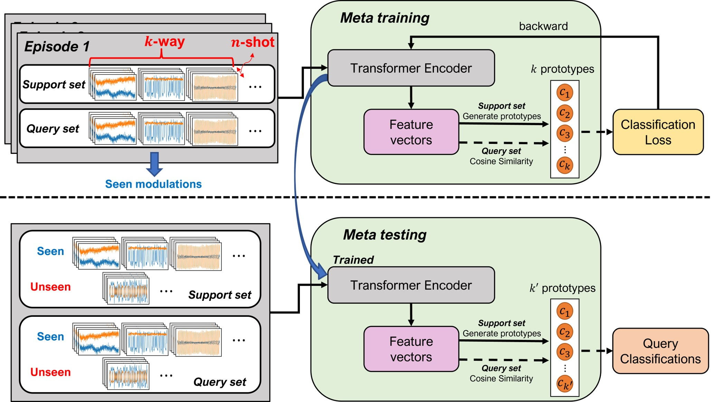

# 

## Toward Scalable Automatic Modulation Classification via Meta-Learning
This paper is under review.

>**Abstract:** *Driven by recent technological breakthroughs in deep learning (DL), many recent automatic modulation classification (AMC) methods utilize deep networks to classify the type of modulation in the incoming signal at the receiver. However, existing DL-based approaches suffer from limited scalability, especially for unseen modulations or input signals from new environments not used in training the DL model, thus not ready for real-world systems such as software defined radio devices. 
In this paper, we introduce a scalable AMC scheme that provides flexibility for new modulations and adaptability to input signals with diverse configurations. We propose a meta-learning framework based on few-shot learning (FSL) to acquire general knowledge and a learning method for AMC tasks. This approach allows the model to recognize new unseen modulations by learning
with only a very small number of samples, without requiring the entire model to be retrained. Additionally, we enhance the scalability of the classifier by leveraging a transformer-based encoder, enabling efficient processing of input signals with varying configurations. Extensive evaluations demonstrate that the proposed AMC method outperforms existing techniques across all signal-to-noise ratios (SNRs) on RadioML2018.01A dataset.*

## Overview of meta-learning architecture 

<div style="text-align: center;">

</div>

## Few-shot learning evaluation
<div style="text-align: center;">
 
</div>

## Input size scalability evaluation
<div style="text-align: center;">


</div>


## Test Environment
The WiReal project has been developed and tested under the following computing environment:

- Python 3.8
- NVIDIA GeForce RTX 3070 graphics card

## Installation

* Clone the repository and install the required dependencies
```
pip install -r requirements.txt
```
## Usage

* Automatic Modulation Classification(AMC)
```
cd AMC

python main.py fs
```

* Wi-Fi Sensing: Human Activity Recognition
```
Work in progress
```
