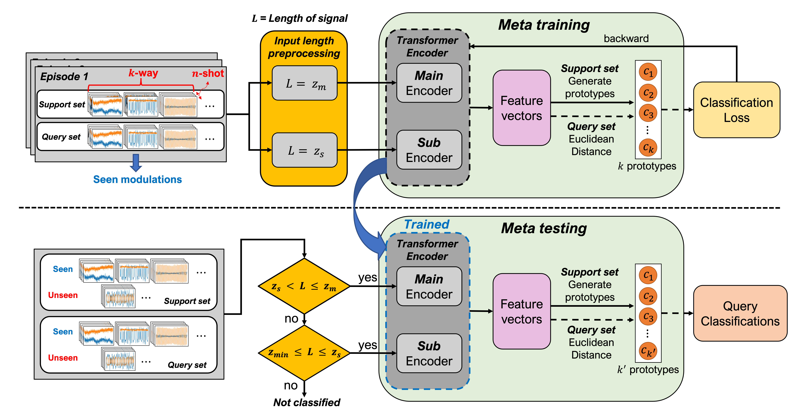
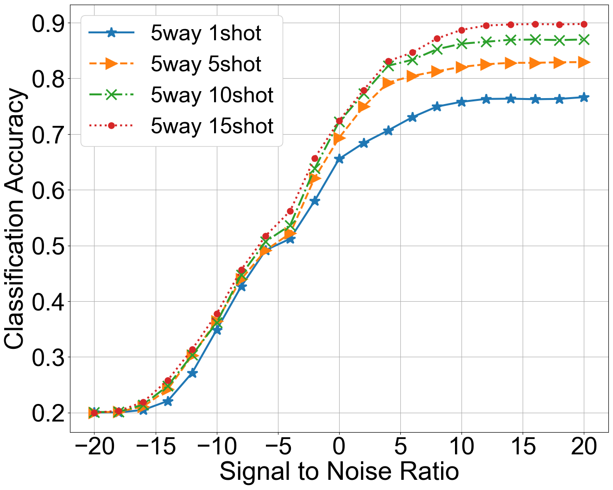
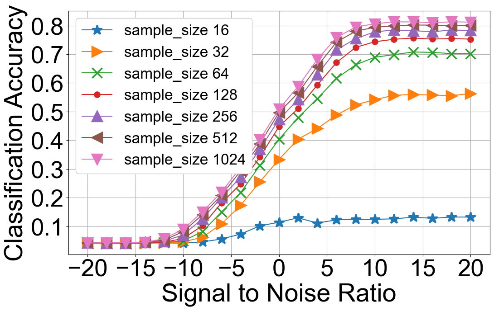
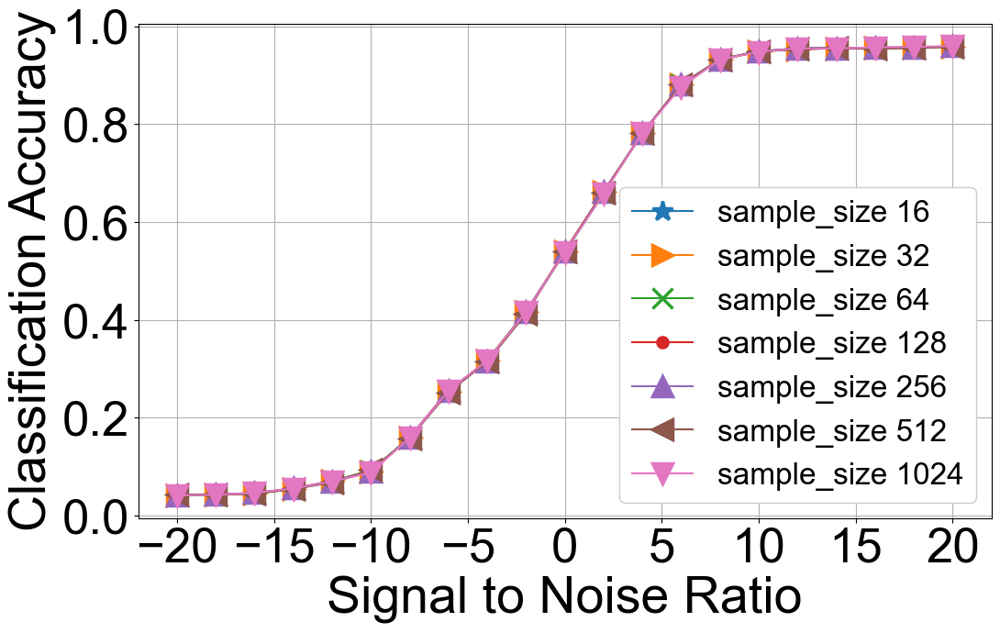

# meta-transformer-amc

## Meta-Transformer: A meta-learning framework for scalable automatic modulation classification
*IEEE Access 2024*  
Paper: https://ieeexplore.ieee.org/abstract/document/10388303

>**Abstract:** *Recent advances in deep learning (DL) have led many contemporary automatic modulation classification (AMC) techniques to use deep networks in classifying the modulation type of incoming signals at the receiver. However, current DL-based methods face scalability challenges, particularly when encountering unseen modulations or input signals from environments not present during model training, making them less suitable for real-world applications like software-defined radio devices. In this paper, we introduce a scalable AMC scheme that provides flexibility for new modulations and adaptability to input signals with diverse configurations. We propose the Meta-Transformer, a meta-learning framework based on few-shot learning (FSL) to acquire general knowledge and a learning method for AMC tasks. This approach empowers the model to identify new unseen modulations using only a very small number of samples, eliminating the need for complete model retraining. Furthermore, we enhance the scalability of the classifier by leveraging main-sub transformer-based encoders, enabling efficient processing of input signals with diverse setups. Extensive evaluations demonstrate that the proposed AMC method outperforms existing techniques across all signal-to-noise ratios (SNRs) on RadioML2018.01A.*

## Computing environment
This project has been developed and tested under the following computing environment:
- Ubuntu 20.04
- Intel(R) i9-9900KF
- GeForce RTX 2080 Ti 11GB
- Python 3.8

## Installation

* Clone the repository and install the required dependencies.
```
pip install -r requirements.txt
```

## Download modulation dataset and pre-trained model
1. Click [here](https://www.deepsig.ai/datasets) to download the RadioML2018.01A dataset.

2. Click [google drive](https://drive.google.com/file/d/1x_amkYkb3m3bdpPeRztMWhJUWxmBSzmk/view?usp=sharing) to download pre-trained models.

3. Place the downloaded dataset and pre-trained models as follows:
```
meta-transformer-amc
   |——————amc_dataset
   |        └——————RML2018
   |                └——————classes-fixed.json
   |                └——————GOLD_XYZ_OSC.0001_1024.hdf5
   └——————checkpoint
            └——————learning
            |       └——————0.tar
            |       └——————1.tar
            |              ...
            └——————size
            └——————unseen
```

## Usage
The default setting classifies 5 unseen modulations using the proposed model pre-trained with 12 random modulations:
```
python main.py test
```
*If you want to run another evaluation, you can proceed by modifying the `config.yaml`.*  
*Various evaluation cases are specified in the paper.*  


## Overview of meta-learning architecture 
<div align="center">

</div>

- Meta-training : the encoder $f_{\theta}$  learns the metric space using prototypes of each class.
- Meta-testing  : module uses trained $f_{\theta}$ for new unseen modulations with fewer (1-5) collected samples. 


## Few-shot learning evaluation
<div align="center">
 
</div>

- This figure shows the results of evaluating 5 random unseen modulations with few shots (1, 5, 10, 15).
- Accuracy is the average value performed 100 times for each test.

<!--
## Input size scalability evaluation
<div align="center">


</div>

- Evaluating the proposed model (**right figure**) using smaller input frames while it was trained with 2x1024 frames.
- The left figure shows the limitations on the input size scalability of CNN-based models.  
- Proposed model only leads to a slight performance degradation, with the minimum difference being approximately **±0.4%**.  
-->

## Citation
If you find this work useful for your research, please cite our paper:
```bibtex
@article{jang2024meta,
  title={Meta-Transformer: A meta-learning framework for scalable automatic modulation classification},
  author={Jang, Jungik and Pyo, Jisung and Yoon, Young-il and Choi, Jaehyuk},
  journal={IEEE Access},
  year={2024},
  publisher={IEEE}
}
```
